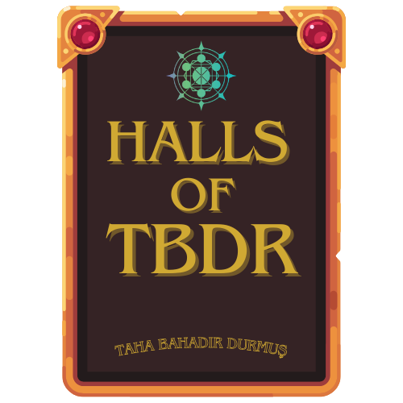

# HALLS OF TBDR

# Three.js Demo with Vue, Vuetify, and Pinia

This is a Three.js demo/experiment built using Vue, Vuetify, and Pinia. It showcases the integration of these technologies to create interactive 3D experiences.

## Demo

You can view the live demo of this project by following this link:

[Demo](https://halls-of-tbdr.vercel.app/)

## About

This project demonstrates the use of Three.js, a popular 3D library, with Vue.js for building interactive 3D web applications. Vuetify is used for the UI components and Pinia for state management.

## Usage

To use this project, simply visit the live demo link provided above.

## License

This project is licensed under the [MIT License](LICENSE).
